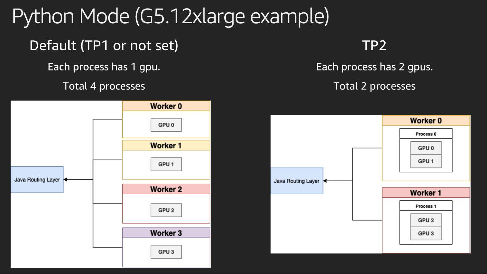
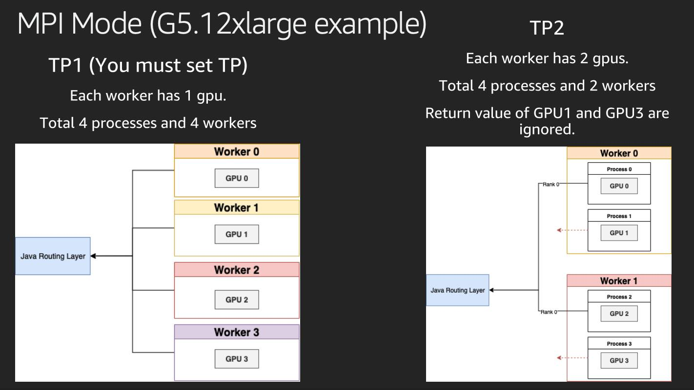

# LMI running Engines

In LMI, we offer two different running mode to operate the backend engine:
- Distributed Environment (MPI): Used to operate on single machine multi-gpu or multiple machines multi-gpu use cases
- Standard Python process (Python): Start a standalone python process to run the engine

Depends on the engine architecture, settings and use case your are pursuing into, you can choose one of the option to run with LMI.
Here we are providing the common Engine selection for different backends we offer:
- TensorRT-LLM (MPI): Use multiple MPI processes to run the backends
- LMI-Dist (MPI): Launching using multiple MPI processes to control for different GPUs
- vLLM (Python): vLLM internally will use Ray to spin up multiple processes, so managed at vLLM layer
- HuggingFace Accelerate (Python): HF Accelerate internally managed the process workflow
- TransformerNeuronX (Python): The Neuron backend engine, internally it will use multi-threading to run with Neuron cores.

In the next section, we will introduce a detailed breakdown on how we run those backends.

## Python Engine operating in LMI (DJLServing)



DJLServing could operate with Python with our Python Engine. In Python operating mode, we will spin up a python process
from the system environment and allocate Accelerators(CPU/Neuron) for each processes through `CUDA_VISIBLE_DEVICES`. During auto-scaling mode,
DJLServing could manage workers' Accelerators allocation and spin up process with different Accelerators (CPU/Neuron).
Under python Engine mode, DJLServing will establish socket connection and talk to the python process.

### Enablement

You can use the following ways to enable Python Engine:

serving.properties

```
engine=Python
```

Environment variable (no need to set)

We use python mode as long as you specify `option.model_id`.

## MPI Engine operating in LMI (DJLServing)



MPI in general means "Multi-Process-Interface". In LMI domain, you could also read as "Multi-Process-Inference".
DJLServing internally will use `mpirun` to spin up multiple processes depends on the setup.
The number of process for LLM applications following `tensor_parallel_degree`. 
To operate in this model, DJLServing established multiple socket connects to each process for communication and health check.
During each operation call (e.g inference), DJLServing will send the same request to each process. At response back time, 
DJLServing will just receive 1 result from rank 0 of the total processes.

MPI model also works well with DJLServing auto-scaling feature, user could specify multiple workers using different GPUs.
DJLServing could spin up the corresponding copies MPI environment.

### Enablement

You can use the following ways to enable MPI Engine:

serving.properties

```
engine=MPI
```

Environment variable

```
OPTION_MPI_MODE=true
```

