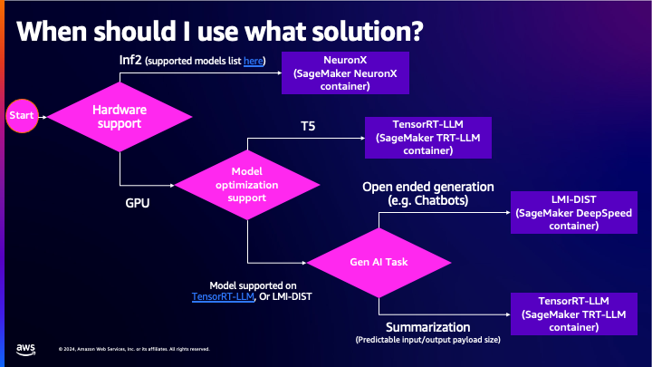

# Backend Selection

The following diagram shows our recommended approach to selecting a backend and container.

The remainder of this document expands on what is covered in the above diagram.

LMI offers multiple inference backend options.
Each backend offers support for certain model architectures, and exhibits unique features and performance characteristics.
In order to achieve the best performance for your use-case, we recommend evaluating multiple backends to understand which one works best for you.

This guide will focus on the important factors you should consider when selecting a backend:

* Model Architecture Support
* Traffic Pattern behavior with respect to input and output length variability
* Cost to host 

If you are looking for a quick start recommendation, we recommend you start with either vLLM or TensorRT-LLM.
These backends are consistently at the top with respect to throughput and latency based on our internal benchmarks.

vLLM is easier to get started with because it does not require model compilation, and is more flexible with respect to input and output length variability.
TensorRT-LLM typically performs slightly better than vLLM, but the model compilation requirement makes it less flexible with respect to input and output length variability.

In terms of use-cases, chat based applications typically exhibit high input/output length variability, and are best served by vLLM.
For lower variability use cases like information extraction and summarization, TensorRT-LLM is a good choice.
You can get started with these backends by following the respective user guides:

* [vLLM user guide](../user_guides/vllm_user_guide.md)
* [TensorRT-LLM user guide](../user_guides/trt_llm_user_guide.md)

## Factor 1: Model Architecture Support

The most important factor when selecting a backend is to use a backend that supports your model architecture.
Some architectures are only supported by a few backends. For example, T5 models are only supported by lmi-dist and TensorRT-LLM.
Llama2 models are supported by all backends.

You can find out model architecture support by referencing the backend [user guides](../user_guides/README.md).

## Factor 2: Use-Case and Traffic Patterns

The traffic pattern you expect plays a large role in selecting an inference backend.
We categorize traffic into two high level buckets: Even Traffic, and Uneven Traffic.
This does not refer to the variability of request load on the model server, but rather the composition of these requests with respect to input and output token lengths.

Even traffic refers to all requests having low variability of input lengths and output lengths.
An example of relatively even traffic would be if most requests contain ~1000 input tokens and ~500 output tokens.
Use-cases that may exhibit even traffic patterns are *Summarization* and *Information Extraction*.
Backends that require model compilation (like TensorRT-LLM and Transformers NeuronX) are excellent choices for such workloads.
The compilation process optimizes the model for a specific input length upper bound and output length upper bound, so if most requests are close to (but don't exceed) these limits, the performance is typically higher compared to non compiled backends.

Uneven traffic refers to high variability of input lengths and output lengths across requests.
An example of uneven traffic would be if, across requests, you observe an even split of inputs in the range of 100-1000 tokens, and outputs in the range of 1000-100 tokens.
Use-cases that may exhibit uneven traffic patterns are *Chat bots*, *Conversational AI*, and *Code Generation*.

Unless you have a good understanding of your traffic patterns upfront, it may be hard to fully optimize compiled backends like TensorRT-LLM and Transformers NeuronX.
We recommend starting with a backend like vLLM that may not be as performant as a compiled backend, but still achieves high performance and is more resilient to variable traffic patterns.
Starting with vLLM allows you to collect data on traffic patterns, and then use that data to understand whether a backend like TensorRT-LLM could be a better fit to achieve higher performance.

Even traffic and Uneven traffic represent extremes on a continuum.
The traffic you expect or observe will likely be a combination of both types of traffic, but may lean towards one type more than the other.
When launching LLMs in production, you might best be served with multiple endpoints each optimized for certain traffic patterns.
We cover this type of system design further in our Advanced [System Design Guide](system-design-guide.md).

To summarize the above:

* For uneven traffic patterns, we recommend `vLLM`. Other good options that may work better for your model are `lmi-dist`, and `deepspeed`
* For even traffic patterns, we recommend `TensorRT-LLM`. 

## Factor 3: Cost to Host

The best way to reduce costs is to use a smaller/cheaper instance type.
In order to use a cheaper instance type, there are a few options:

* Use a smaller model (e.g. use the llama2-13b model instead of the llama2-70b model)
* Quantize your model to a lower precision data type
* Switch to a cheaper instance class like AWS Inferentia2 instances

Using a smaller model is the easiest option, but it may not be practical as larger models tend to produce higher quality results.
If you are using the Llama2-70b model, you may not find the results from the Llama2-13b model acceptable for your use case.

Instead of switching to a smaller model, you can also use quantization to lower the memory footprint of a model.
The lower memory footprint can enable deployments to smaller instances.
Each inference backend offers support for different quantization methods.
Across LMI, we offer GPTQ, AWQ, SmoothQuant, and Int8 quantization.
Quantization does lead to lower quality, but the quality degradation is usually acceptable and a better option than switching to a smaller model.
Refer to the backend [user guides](../user_guides/README.md) to learn about the quantization methods available in each backend.

Another option is to switch from GPU based instances to AWS Inferentia2 instances using Transformers NeuronX.
These instances are typically cheaper than the equivalent G5/P4 instances, but Transformers NeuronX has less model architecture support than other backends.
You can see what model architectures are supported by Transformers NeuronX in the [user guide](../user_guides/tnx_user_guide.md).

Next: [Container Configuration](configurations.md)

Previous: [Instance Type Selection](instance-type-selection.md)