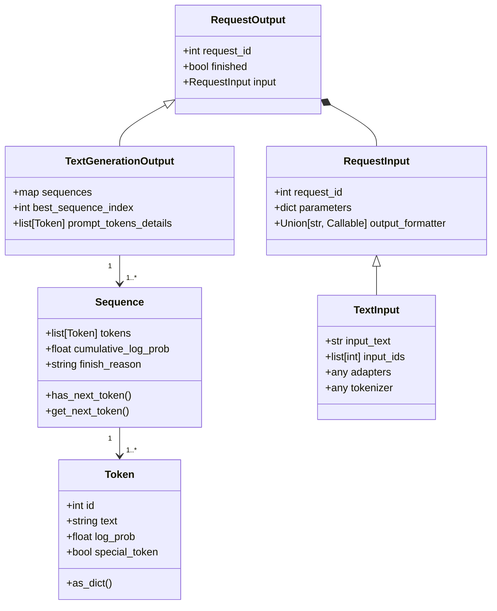

# Custom output formatter schema

This document provides the schema of the output formatter, with which you can write your own custom output formatter. 


## Signature of your own output_formatter

To write your own custom output formatter, follow the signature below:
```
from djl_python.output_formatter import RequestOutput

def custom_output_formatter(request_output: RequestOutput) -> str:
    #your implementation here
```

## RequestOutput schema
The RequestOutput class is designed to encapsulate the output of a request in a structured format. Here is an in-depth look at its structure and the related classes:


### Detailed Description

- **RequestOutput**: This is the main class that encapsulates the output of a request.
- **TextGenerationOutput**: This subclass of RequestOutput is specific to text generation tasks. Right now this is the only task supported for custom output formatter. Each text generation task can generate multiple sequences. 
  - best_sequence_index: index of the best sequence with the highest log probabilities. Please use this, when you are trying to look up the output sequence. 
  - Note that, right now, only one sequence will be generated. In the future release, multiple sequences generation will be supported. 
- **Sequence** : Represents a sequence of generated tokens and it's details 
  - has_next_token() and get_next_token() methods function like an iterator. In iterative generation, each step produces a single token.
  - get_next_token() advances the iterator to the next token and returns a Token instance along with details indicating whether it is the first token (first_token) and whether it is the last token (last_token).

## Example
Here is an example of a custom output formatter:
```python
from djl_python.output_formatter import TextGenerationOutput
import json

def custom_output_formatter(request_output: TextGenerationOutput):
    """
    Replace this function with your custom output formatter.

    Args:
        request_output (TextGenerationOutput): The request output

    Returns:
        (str): Response string

    """
    best_sequence = request_output.sequences[request_output.best_sequence_index]
    next_token, first_token, last_token = best_sequence.get_next_token()
    result = {"token_id": next_token.id, "token_text": next_token.text, "token_log_prob": next_token.log_prob}
    if last_token:
        result["finish_reason"] = best_sequence.finish_reason
    return json.dumps(result) + "\n"
```